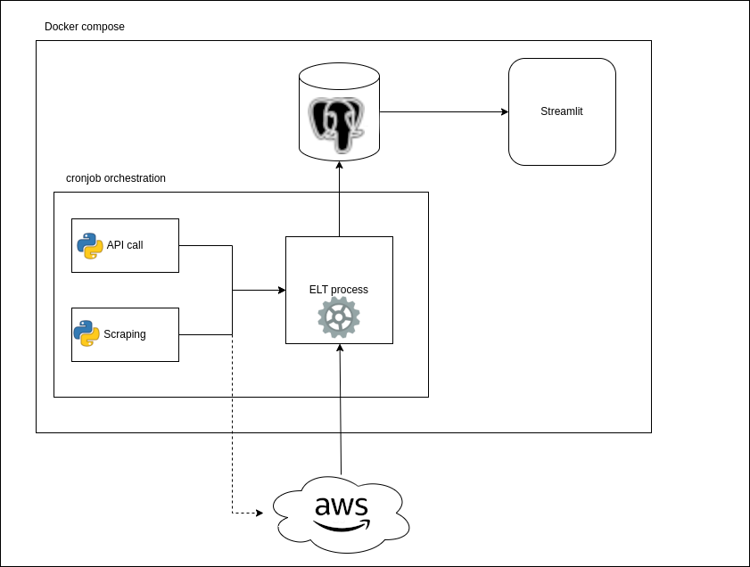

# Kayak Hotels Reservation

A Streamlit application to explore hotel and weather across various cities in France. The dashboard provides insights into average ratings, popularity, hotels ratings, and weather forecast to help making informed decisions when planning a trip.

## Description
The Kayak Hotels Reservation project consists of a frontend built with Streamlit and a backend that handles data scraping and processing. The application fetches hotel and weather data from a PostgreSQL database and presents it using various interactive visualizations.

## Repo architecture
```
.
├── back                                
│   ├── big_data.py             <-- Class for AWS communication
│   ├── caller.py               <-- Script to make API call
│   ├── cronjob                 <-- Orchestration automatique script run
│   ├── data_models.py          <-- Postgresql Table definition
│   ├── Dockerfile
│   ├── etl.py                  <-- Script for all ETL process
│   ├── main.py                 <-- Main script launched every day
│   ├── param.py                <-- Various params variable
│   ├── requirements.txt        <-- All dependencies listed fron backend
│   ├── s3_files.log            <-- Logs with all files pushed to s3
│   ├── scraper.py              <-- Script to scrape Bookings
│   └── tester.py               <-- Testing script for scraping
├── docker-compose.yaml
├── front
│   ├── Dockerfile
│   ├── front.py                <-- Streamlit front app
│   └── requirements.txt        <-- All dependencies listed for frontend
└── template.env                <-- Template with empty needed env variable
```

## Installation
### Prerequisites
- Python 3.10+
- Docker
- Docker compose

### Steps
1. Clone repository:  
```bash
git clone git@github.com:GrGLeo/kayak-project.git
cd kayak_project
```
2. Set up the environment variables:  
```bash
cp template.env .env
```
The following variable needs to be set:
```makefile
POSTGRES=your_postgres_connection_string
AWS_ACCESS_KEY_ID=your_aws_access_key
AWS_SECRET_ACCESS_KEY=your_aws_secret_key
API_KEY=your_weather_api_key
```

3. Build and start the application using Docker compose:
```bash
docker compose up --build
```

## Usage
The application consist of a frontend and a backend.


### Backend Process
1. **Data Scraping**:
    - Hotels Data: Scrapes hotel information from Booking.com for the 30 most visited cities in France. This includes the hotel's name, URL, description, and various ratings.
    - Weather Data: Calls an API to gather weather information for the same 30 cities, including temperature, weather conditions, and a 5-day forecast.
2. **Data Storage**:
    - Raw data files are pushed to an S3 bucket.
3. **ETL Process**:
    - The raw data is cleaned and processed.
    - Cleaned data is then pushed to an on-premise PostgreSQL database.
4. **Automation**:
    - All processes are orchestrated to run daily using a cronjob.

### Frontend Process
1. **User Interface**:
    - Built using Streamlit, the frontend provides an interactive interface for users to explore hotel and weather data.
2. **Data Fetching**:
    - The frontend fetches data from the PostgreSQL database.
3. **Visualization**:
    - **Hotel Data**: Visualizes hotel ratings, popularity, and attributes using charts and tables.
    - **Weather Data**: Displays current weather conditions and a 5-day weather forecast for the 30 cities.
4. **Interaction**:
    - Users can select different cities to view specific hotel and weather information.
    - Provides filter and sort options to refine the displayed data. 

## Improvements
Future enhancements that can be made to the project:  
- [ ] **Adding pricing for hotel rooms**:
    - Scrape and integrate room pricing information for the hotels to provide users with cost insights.
    - Display the pricing data alongside the other hotel attributes in the visualizations.
- [ ] **Better logs**:
    - Implement a more robust logging system to track the scraping, ETL, and data fetching processes.
    - Provide detailed logs for error tracking and performance monitoring.
